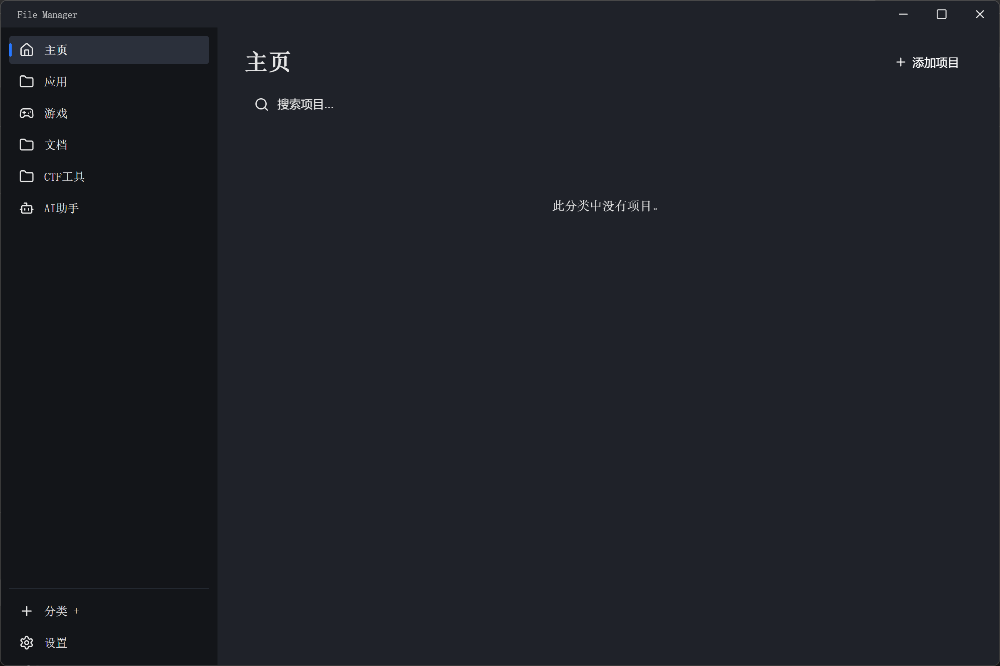
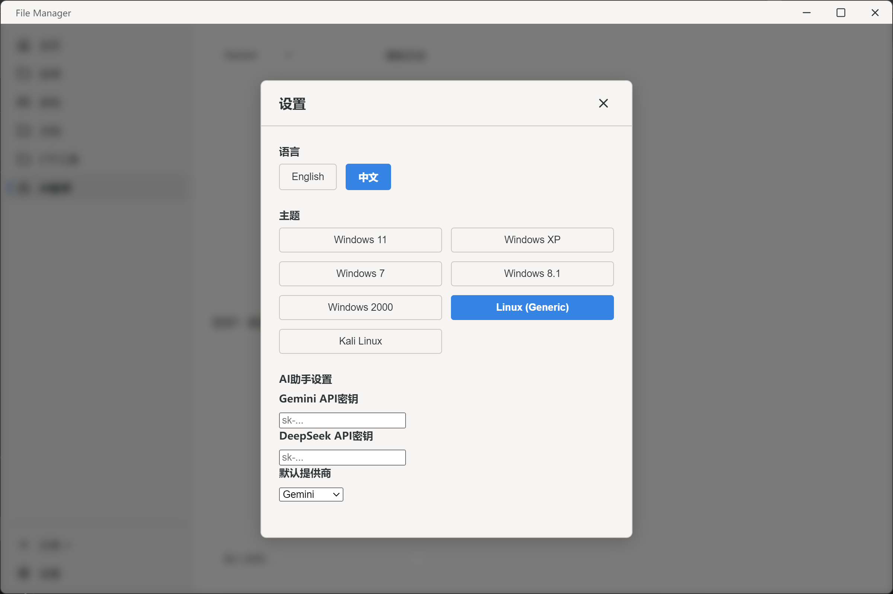
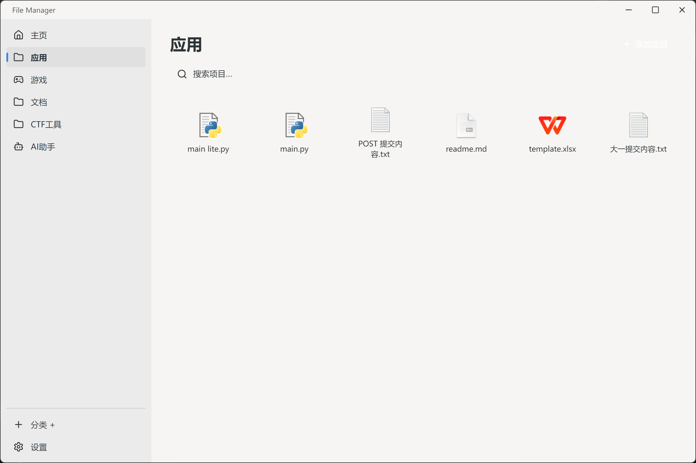

# Windows 11 Custom File Manager | Windows 11 自定义文件管理器 🚀

[English](#english) | [简体中文](#简体中文)

---

<a name="english"></a>
## English

A modern, high-performance file manager built with **React**, **Vite**, and **Electron**, featuring a sleek Windows 11 aesthetic and integrated AI assistance.


### 🏗 Architecture
- **Framework**: **Electron** for cross-platform desktop integration.
- **Frontend**: **React 19** for a component-based reactive UI.
- **Build Tool**: **Vite** for fast development and optimized production builds.
- **Communication**: Secure **IPC (Inter-Process Communication)** between the Renderer and Main processes.
- **AI Backend**: Proxy requests to **Gemini** & **DeepSeek** via the Main process to ensure API key security and bypass CORS.
- **Design System**: Atomic CSS with theme-specific variable injection for instant skin switching.

### 📂 File Structure
```text
├── electron/               # Main process logic
│   ├── main.cjs            # App lifecycle, IPC handlers (File icons, Shell)
│   └── preload.cjs         # Secure API bridge (ContextBridge)
├── src/                    # Frontend source code
│   ├── components/         # Modular UI units (Modals, Dashboard, SideBars)
│   ├── locales/            # i18n translation source (zh/en)
│   ├── utils/              # Configuration & Persistence logic
│   ├── App.jsx             # Core application state & layout
│   └── main.jsx            # React entry point
├── public/                 # Static assets (Favicons, Icons)
├── Latest-Release/         # Pre-built Windows executable & Installer
│   ├── win-11-file-manager.exe        # Portable version
│   └── Windows-11-File-Manager-Setup.exe # Installer (Setup)
└── package.json            # Node.js dependencies & Build scripts
```

### ✨ Key Features
- **Real File Icons**: Automatically extracts and displays actual system icons for apps, files, and folders.
- **Smart Drag & Drop**: Effortlessly add files by dragging them directly into the dashboard.
- **Advanced Context Menus**: Full right-click support for items, categories, and background.
- **AI Assistant**: Deep integration with Gemini/DeepSeek for contextual help.
- **7 OS Themes**: Pixel-perfect recreations of classic and modern OS aesthetics.

### 🖼 Screenshots
| Main Interface | Settings & AI Config | File Icons & Items |
| :---: | :---: | :---: |
|  |  | 

### 🚀 Getting Started
```bash
git clone https://github.com/your-username/win11-file-manager.git
npm install
npm run electron:dev
```

---

<a name="简体中文"></a>
## 简体中文

基于 **React**、**Vite** 和 **Electron** 构建的现代化、高性能文件管理器。

### 🏗 系统架构
- **核心框架**：使用 **Electron** 实现跨平台桌面能力。
- **前端技术**：采用 **React 19** 构建响应式组件化界面。
- **构建工具**：基于 **Vite** 的极速热更新开发环境与生产优化。
- **进程通信**：通过 **IPC (进程间通信)** 安全隔离渲染进程与主进程。
- **AI 集成**：主进程代理 **Gemini** 和 **DeepSeek** 请求，保障 API Key 安全并解决跨域。
- **设计系统**：纯 CSS 实现的原子化样式，通过变量注入支持 7 款系统主题实时切换。

### � 项目目录
```text
├── electron/               # 桌面端主进程逻辑
│   ├── main.cjs            # 生命周期管理、IPC 处理器 (图标提取、系统调用)
│   └── preload.cjs         # 安全桥接层 (ContextBridge)
├── src/                    # 前端源代码
│   ├── components/         # 模块化 UI 组件 (对话框、仪表盘、工具栏)
│   ├── locales/            # 国际化语言包 (中/英)
│   ├── utils/              # 配置持久化与工具函数
│   ├── App.jsx             # 应用主状态及布局中心
│   └── main.jsx            # 渲染进程入口
├── public/                 # 静态资源 (应用图标等)
├── Latest-Release/         # 编译好的 Windows 可执行程序与安装包
│   ├── win-11-file-manager.exe        # 便携版
│   └── Windows-11-File-Manager-Setup.exe # 安装程序 (Setup)
└── package.json            # 依赖管理与编译脚本
```

### ✨ 核心功能
- **真实文件图标**：基于 Electron API 提取 .exe 及文件夹的原生图标。
- **智能拖放支持**：支持从外界直接拖入文件或文件夹自动分类。
- **功能增强菜单**：集成管理员启动、所在文件夹定位、属性查看等功能。
- **AI 智能助手**：内置 AI 侧边栏，支持多种大语言模型。
- **多主题切换**：内置 Windows 11/XP/7/8.1, Kali, Linux 等多套深度定制主题。

### 🖼 软件截图
| 主界面 | 设置与 AI 配置 | 文件图标与列表 |
| :---: | :---: | :---: |
|  |  | 

### 🚀 快速上手
```bash
git clone https://github.com/your-username/win11-file-manager.git
npm install
npm run electron:dev
```

---
*Created with ❤️ by Antigravity*
